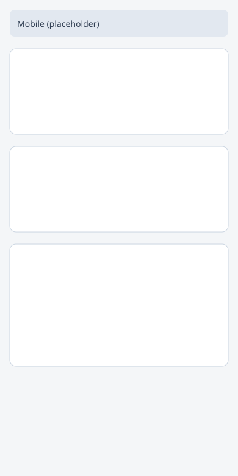
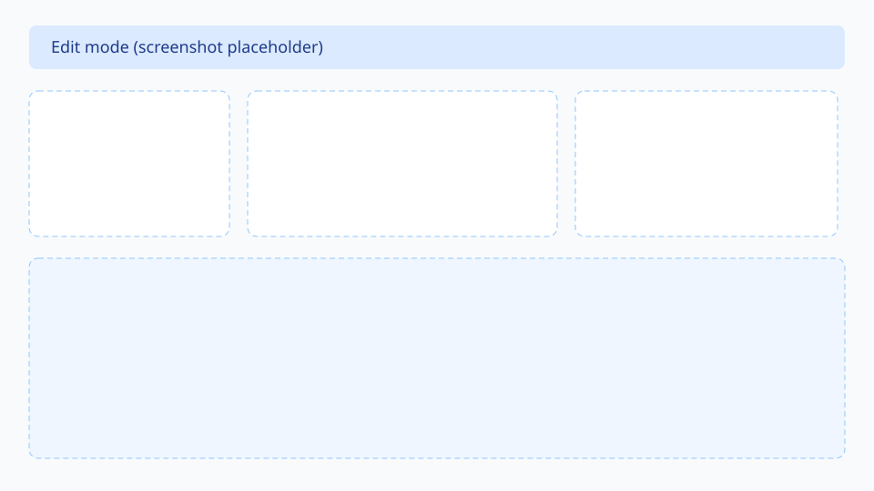

# Dashora

**A self-hosted personal dashboard for the information you check every day.**

Dashora puts feeds, weather, calendars, bookmarks, markets, and other first-party widgets on a calm, responsive grid that you own and run on your own hardware. Secrets stay on the server. Your data stays local.

> **Inspiration, not a fork.** Dashora is an independent product and codebase. [Glance](https://github.com/glanceapp/glance) inspired the *category* of a self-hosted personal dashboard; Dashora does not copy Glance source, templates, assets, naming, CSS, or documentation.

---

## Screenshots

<!-- Replace these placeholders with real captures when ready. -->

| Light | Dark |
| --- | --- |
|  |  |

| Mobile | Edit mode |
| --- | --- |
|  |  |

---

## Key features

- **Personal home screen** — Multiple pages, a 12-column responsive layout, and edit mode for arranging widgets.
- **First-party widgets** — Search, clock, bookmarks, todo, weather, RSS, calendar, GitHub, markets, news feeds, YouTube, Twitch, Custom API, and sandboxed iFrame embeds.
- **Server-side secrets** — Integration tokens are encrypted at rest and never sent to the browser.
- **Stale-while-revalidate** — Prefer last-good data with a clear stale signal over a blank failure while refresh continues.
- **Local session auth** — Argon2id passwords, HttpOnly cookies, CSRF protection, and rate limits on login and first-run setup.
- **Light and dark themes** — Appearance settings with practical WCAG AA contrast, keyboard navigation, and reduced-motion respect.
- **Config backup / restore** — Export and import dashboard configuration from Settings (plus full SQLite volume backups for disaster recovery).
- **Docker-first deploy** — Production Compose stack with nginx, a persistent `/data` volume, and multi-arch image builds (`linux/amd64`, `linux/arm64`).

---

## Dashora versus Rackora

Dashora and Rackora are sibling products with different jobs.

| | Dashora | Rackora |
| --- | --- | --- |
| Primary job | Personal information dashboard | Infrastructure inventory and operations |
| Mental model | “What do I need to see today?” | “What is in my racks, network, and lab?” |
| Core objects | Pages, widgets, layout, credentials | Rooms, racks, devices, ports, cables, IPAM |
| Interaction | Glanceable cards and feeds on a grid | Structured inventory, topology, and ops workflows |

They may share engineering taste (TypeScript, Fastify, React, SQLite, self-hosting) and the `-ora` naming family, but they are separate products with separate repositories and release cycles. Dashora is not a rack inventory tool.

---

## Quick Docker Compose install

**Requirements:** Docker and Docker Compose.

```bash
git clone https://github.com/GitTheums/Dashora.git
cd Dashora
docker compose up --build
```

| URL | Purpose |
| --- | --- |
| http://localhost:8080 | Web UI + API (via nginx) |
| http://localhost:3000/api/v1/health | API health check |

Published multi-arch images (`linux/amd64`, `linux/arm64`):

```bash
docker pull ghcr.io/gittheums/dashora:1.0.0
```

Useful overrides:

```bash
# Timezone (IANA name)
TZ=Europe/Berlin docker compose up --build

# Persist data on the host instead of a named volume
DASHORA_DATA_BIND=./data docker compose up --build

# Different host ports
DASHORA_HOST_PORT=3001 DASHORA_HTTP_PORT=8081 docker compose up --build
```

For production, set a public URL and a secrets encryption key (see [Configuration](./docs/configuration.md)):

```bash
export DASHORA_PUBLIC_URL=https://dashora.example.com
export SECRETS_ENCRYPTION_KEY="$(openssl rand -hex 32)"
docker compose up --build -d
```

Full guide: [Installation](./docs/installation.md).

---

## First-run setup

On the first start with an empty database, Dashora logs a one-time setup URL:

```text
Dashora first-run setup required. Open: http://localhost:8080/setup?token=...
```

1. Open the URL from the container logs (`docker compose logs dashora`).
2. Create the operator account (email, display name, password — minimum 12 characters).
3. Sign in and add widgets from the library.

The setup token is single-use, time-limited (default 24 hours), and rate-limited. After setup completes, the `/setup` flow is disabled.

Details: [Installation — first-run setup](./docs/installation.md#first-run-setup).

---

## Configuration

Dashora is configured primarily through environment variables. In Compose, common values are `DASHORA_PUBLIC_URL`, `TZ`, `TRUST_PROXY`, and `SECRETS_ENCRYPTION_KEY` / `SECRETS_ENCRYPTION_KEY_FILE`.

| Variable | Purpose |
| --- | --- |
| `DASHORA_DATA_DIR` | SQLite and durable files (default `/data` in Docker) |
| `CORS_ORIGIN` / `PUBLIC_BASE_URL` | Browser origin / setup URL base |
| `SECRETS_ENCRYPTION_KEY` | 64-hex-char key for encrypting integration secrets |
| `GITHUB_TOKEN`, `REDDIT_*`, `TWITCH_*`, … | Optional provider credentials (server-only) |

Never put provider tokens in the web app or client bundle.

Full reference: [Configuration](./docs/configuration.md).

---

## Supported widgets

| Widget | Notes |
| --- | --- |
| Search | Configurable engines and quick links |
| Clock | Local / secondary timezones |
| Bookmarks | Grouped links |
| Todo | Persistent tasks in SQLite |
| Weather | Open-Meteo (no API key) |
| RSS | Multiple feeds with failure isolation |
| Calendar | ICS/iCal feeds (optional basic auth) |
| GitHub Repository / Releases | Optional PAT for private repos / higher limits |
| Markets | CoinGecko + Finnhub adapters |
| Hacker News / Lobsters / Reddit | News feeds (Reddit needs app credentials) |
| YouTube | Channel uploads via Atom feeds |
| Twitch | Live status via Helix |
| Custom API | Server-side JSON → fixed presentation model |
| iFrame | Sandboxed https embeds |

Catalog details: [Supported widgets](./docs/widgets/index.md).

---

## Updates

```bash
# Backup first — see docs/backup-restore.md
export DASHORA_IMAGE_TAG=1.0.0
docker pull "ghcr.io/gittheums/dashora:${DASHORA_IMAGE_TAG}"
docker tag "ghcr.io/gittheums/dashora:${DASHORA_IMAGE_TAG}" "dashora:${DASHORA_IMAGE_TAG}"
# or: docker compose build dashora
docker compose up -d
curl -fsS http://localhost:3000/api/v1/health
```

Migrations run automatically on startup. Prefer pinned GHCR tags (`ghcr.io/gittheums/dashora:1.0.0`) in production.

Guide: [Upgrading](./docs/upgrading.md).

---

## Backups

Two complementary approaches:

1. **Config export** (Settings → Backup) — JSON export/import of dashboards, widgets, todos, integrations metadata, and appearance.
2. **Volume / SQLite backup** — Full disaster recovery of `$DASHORA_DATA_DIR` (including `dashora.sqlite`). Also back up `SECRETS_ENCRYPTION_KEY`; without it, stored secrets cannot be decrypted.

Guide: [Backup and restore](./docs/backup-restore.md).

---

## Reverse proxy

The bundled Compose stack already includes nginx on port 8080. For an external proxy (Caddy, Traefik, another nginx), terminate TLS in front of Dashora, forward `/api/` to the API, serve the SPA (or proxy to the bundled proxy), and set:

- `DASHORA_PUBLIC_URL` / `CORS_ORIGIN` / `PUBLIC_BASE_URL` to your https origin
- `TRUST_PROXY=true` only when the proxy strips client-supplied `X-Forwarded-*` headers
- `COOKIE_SECURE=true` (or `auto` in production) behind HTTPS

Guide: [Reverse proxy](./docs/reverse-proxy.md).

---

## Security warning

Dashora is self-hosted software that often sits next to powerful credentials. **Treat it as a trusted-operator tool, not a hardened multi-tenant SaaS.**

- Expose it only on a private network or behind authentication and TLS you control.
- Set `SECRETS_ENCRYPTION_KEY` (or `*_FILE`) before storing integration secrets.
- Never commit `.env` files, encryption keys, or provider tokens.
- Read [SECURITY.md](./SECURITY.md) and [docs/security-model.md](./docs/security-model.md) before internet exposure.

Known limitations today include no MFA, no password-reset flow, and a single-operator model. See SECURITY.md for the full list of accepted risks.

---

## Development

```bash
pnpm install
pnpm dev
```

| App | URL |
| --- | --- |
| Web | http://localhost:5173 |
| API | http://localhost:3000 |

```bash
pnpm lint && pnpm typecheck && pnpm test && pnpm build
```

Guide: [Development](./docs/development.md). Widget authors: [Widget development](./docs/widget-development.md).

---

## Roadmap

- **v1.0** — Shipped: single-operator personal dashboard (auth, layout, first-party widgets, secrets, caching, Compose + GHCR packaging).
- **v1.x** — More widgets, optional OIDC / proxy-auth docs, backup polish, further hardening.
- **v2** — Deliberate extensibility only after an ADR revisits the plugin policy (no arbitrary remote JS plugins).

Details: [Roadmap](./docs/roadmap.md). Release process: [Release checklist](./docs/release-checklist.md).

---

## Contributing

See [CONTRIBUTING.md](./CONTRIBUTING.md) and the [Code of Conduct](./CODE_OF_CONDUCT.md).

1. Open an issue or draft PR describing the change.
2. Keep Dashora original — do not copy Glance or other dashboard source, templates, assets, naming, CSS, or docs.
3. Follow the engineering rules in [AGENTS.md](./AGENTS.md): TypeScript strict mode, Zod validation, tests for new API routes, light/dark UI, accessible controls.
4. Run `pnpm lint`, `pnpm typecheck`, `pnpm test`, and `pnpm build` before requesting review.
5. New widgets are first-party TypeScript modules in this repo — see [Widget development](./docs/widget-development.md).

Architecture and ADRs live under [`docs/`](./docs/README.md). Changelog: [CHANGELOG.md](./CHANGELOG.md).

---

## License

Apache-2.0 — see [LICENSE](./LICENSE).

---

## Acknowledgements

- **[Glance](https://github.com/glanceapp/glance)** — Product inspiration for the self-hosted personal dashboard *category*. Dashora is not a fork, skin, or derivative of Glance, and does not depend on Glance as a library or codebase.
- The broader self-hosted community for patterns around Docker packaging, reverse proxies, and operator-owned data.
- Contributors and early operators who file issues, improve docs, and add first-party widgets.
