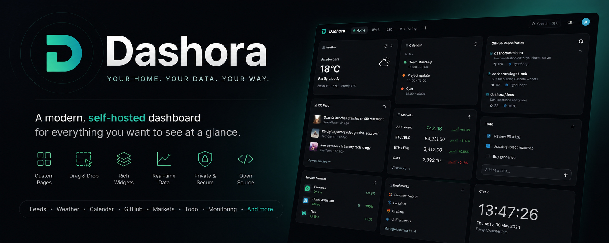

<p align="center">
  
</p>

<p align="center">
  <strong>A modern, self-hosted personal dashboard for everything you want to see at a glance.</strong>
</p>

<p align="center">
  Build your own pages, arrange widgets with drag and drop, and keep your data on infrastructure you control.
</p>

<p align="center">
  <a href="https://github.com/GitTheums/Dashora/releases">
    
  </a>
  <a href="https://github.com/GitTheums/Dashora/actions/workflows/ci.yml">
    
  </a>
  <a href="https://github.com/GitTheums/Dashora/blob/main/LICENSE">
    
  </a>
  
  
</p>

<p align="center">
  <a href="#what-is-dashora">Overview</a>
  ·
  <a href="#features">Features</a>
  ·
  <a href="#widgets">Widgets</a>
  ·
  <a href="#quick-start">Quick start</a>
  ·
  <a href="#documentation">Documentation</a>
  ·
  <a href="#development">Development</a>
</p>

---

## What is Dashora?

Dashora is a self-hosted personal information dashboard. It brings the things you check throughout the day—weather, feeds, calendars, markets, GitHub activity, bookmarks, tasks, media, and more—together in one calm, responsive interface.

Create multiple pages, add only the widgets you need, and arrange each dashboard through a visual drag-and-drop editor. Dashora runs on your own hardware, stores its persistent data in SQLite, and keeps provider credentials on the server.

> **Dashora is an information hub, not an infrastructure management platform.**  
> For detailed Proxmox, VM, LXC, Docker, and homelab management, see the separate Rackora project.

### Built around four principles

| Principle | What it means |
| --- | --- |
| **Personal** | Your pages, widgets, layout, theme, branding, and data sources |
| **Glanceable** | Important information should be understandable within seconds |
| **Local-first** | Persistent data stays on your own server by default |
| **Resilient** | One unavailable feed or provider should never break the whole dashboard |

---

## Features

| Area | What Dashora provides |
| --- | --- |
| **Dashboard pages** | Create, rename, reorder, duplicate, and remove multiple pages |
| **Visual editor** | Drag, resize, undo, and persist widget layouts |
| **Responsive layouts** | Independent desktop, tablet, and mobile arrangements |
| **Widget catalog** | Searchable first-party widget library with settings and previews |
| **Appearance** | Light, dark, and system mode with multiple polished presets |
| **Personalization** | Accent colors, density, card radius, ambient background, custom name, and logo |
| **Local authentication** | Secure first-run setup, Argon2id passwords, server-side sessions, and rate limiting |
| **Server-side integrations** | Provider tokens and credentials never need to enter the browser bundle |
| **Reliable refreshes** | Independent widget loading, caching, stale states, and manual refresh |
| **Backup and restore** | Versioned configuration export/import plus full SQLite volume backups |
| **Docker-first deployment** | Multi-stage image, healthcheck, non-root runtime, and persistent `/data` storage |
| **Multi-architecture images** | Published for `linux/amd64` and `linux/arm64` |

---

## Widgets

Dashora ships with first-party widgets maintained inside this repository. There is no remote JavaScript plugin marketplace or runtime plugin CDN.

### Utilities and productivity

| Widget | Description |
| --- | --- |
| **Search** | Configurable search engines, keyboard shortcut, and quick links |
| **Clock** | Local time, secondary timezone, date format, and 12/24-hour display |
| **Bookmarks** | Grouped links with custom labels and visual organization |
| **Todo** | Persistent tasks with completion, reordering, and optional due dates |

### Information and feeds

| Widget | Description |
| --- | --- |
| **Weather** | Current conditions and forecasts through Open-Meteo |
| **RSS** | Multiple RSS and Atom feeds with feed-level failure isolation |
| **Calendar** | Privacy-conscious ICS/iCal agenda with optional basic authentication |
| **Hacker News** | Top, new, best, Ask, Show, and Jobs feeds |
| **Lobsters** | Hottest, newest, active, and tag-based stories |
| **Reddit** | Subreddit listings through Reddit OAuth |
| **YouTube** | Channel uploads through Atom feeds |
| **Twitch** | Live status for configured Twitch channels |

### Development and markets

| Widget | Description |
| --- | --- |
| **GitHub Repository** | Stars, forks, issues, pull requests, and repository activity |
| **GitHub Releases** | Latest releases for one or more repositories |
| **Markets** | Crypto, equity, and index watchlists through provider adapters |
| **Custom API** | Server-side JSON requests mapped into a restricted presentation model |
| **iFrame** | Sandboxed HTTPS embeds with optional host allowlisting |

See the complete catalog in [`docs/widgets/index.md`](docs/widgets/index.md).

---

## Dashora versus Rackora

Dashora and Rackora are related by naming and design philosophy, but solve different problems.

| | Dashora | Rackora |
| --- | --- | --- |
| **Purpose** | Personal information dashboard | Proxmox and homelab control center |
| **Main content** | Feeds, weather, calendars, media, markets, bookmarks, tasks | Nodes, VM/LXC status, Docker containers, storage, temperatures, uptime |
| **Daily question** | “What do I want to see today?” | “How is my infrastructure doing?” |
| **Interaction** | Browse and organize information | Monitor and manage infrastructure |

---

## How the production stack works

The recommended Docker Compose deployment contains three services:

| Service | Purpose | Expected state |
| --- | --- | --- |
| `dashora` | Fastify API, authentication, SQLite, integrations, and widget providers | Running and healthy |
| `assets` | Copies the built frontend into the shared web-assets volume | Exits successfully with code `0` |
| `proxy` | nginx web server for the frontend and reverse proxy for `/api` | Running and healthy |

> [!IMPORTANT]
> Open the nginx port for the normal Dashora interface. Opening the API port directly returns JSON instead of the web application.

| Address | Purpose |
| --- | --- |
| `http://SERVER-IP:8080` | Normal Dashora web interface |
| `http://SERVER-IP:3000/api/v1/health` | Direct API health endpoint |
| `http://localhost:5173` | Vite development server only; not used by the production image |

`localhost` always refers to the machine on which the browser or command is running. From another computer, replace it with the IP address or hostname of the Docker server.

---

## Quick start

### Requirements

- Docker Engine
- Docker Compose plugin
- Approximately 512 MB RAM for a personal deployment
- A few hundred MB of disk space plus your SQLite data

### Recommended: published GHCR image

Clone the repository so Compose can use the included nginx configuration and service definitions:

```bash
git clone https://github.com/GitTheums/Dashora.git
cd Dashora
```

Create a registry-image override:

```bash
cat > compose.ghcr.yaml <<'YAML'
services:
  dashora:
    image: ghcr.io/gittheums/dashora:1.0.1
    pull_policy: always

  assets:
    image: ghcr.io/gittheums/dashora:1.0.1
    pull_policy: always
YAML
```

Set the public URL. Replace the example address with the LAN IP, hostname, or HTTPS URL through which you will open Dashora:

```bash
cat > .env <<'ENV'
DASHORA_PUBLIC_URL=http://192.168.1.100:8080
TZ=Europe/Amsterdam
ENV
```

Validate the final Compose configuration before starting:

```bash
docker compose -f compose.yaml -f compose.ghcr.yaml config
```

Start Dashora:

```bash
docker compose -f compose.yaml -f compose.ghcr.yaml pull
docker compose -f compose.yaml -f compose.ghcr.yaml up -d
```

Check the services:

```bash
docker compose -f compose.yaml -f compose.ghcr.yaml ps
docker compose -f compose.yaml -f compose.ghcr.yaml ps -a
```

Expected result:

- `dashora` is running and healthy;
- `proxy` is running and healthy;
- `assets` is `Exited (0)` after copying the frontend files.

Open:

```text
http://SERVER-IP:8080
```

For example:

```text
http://192.168.1.100:8080
```

> [!NOTE]
> Port `3000` is the API, not the normal web interface. Port `5173` is development-only.

### Build from source

```bash
git clone https://github.com/GitTheums/Dashora.git
cd Dashora

docker compose config
docker compose up --build -d
```

### Useful commands

```bash
# Container status
docker compose -f compose.yaml -f compose.ghcr.yaml ps

# Include one-shot services such as assets
docker compose -f compose.yaml -f compose.ghcr.yaml ps -a

# Follow application logs
docker compose -f compose.yaml -f compose.ghcr.yaml logs -f dashora

# Follow proxy logs
docker compose -f compose.yaml -f compose.ghcr.yaml logs -f proxy

# Find a newly generated setup URL
docker compose -f compose.yaml -f compose.ghcr.yaml logs --since=2m dashora \
  | grep -F "Dashora first-run setup required"

# Stop without deleting persistent volumes
docker compose -f compose.yaml -f compose.ghcr.yaml down
```

Full installation instructions: [`docs/installation.md`](docs/installation.md).

---

## First-run setup

A new Dashora installation does not create a default administrator account.

On the first start with an empty database, Dashora generates a single-use setup token and writes the plaintext setup URL to the application logs:

```text
Dashora first-run setup required. Open: http://SERVER-IP:8080/setup?token=...
```

Retrieve it immediately:

```bash
docker compose -f compose.yaml -f compose.ghcr.yaml logs --since=2m dashora \
  | grep -F "Dashora first-run setup required"
```

Then:

1. Open the complete URL from the logs.
2. Create the operator account.
3. Sign in.
4. Add and arrange your first widgets.

### Important token behavior

- Only a hash of the setup token is stored in SQLite.
- The plaintext token is logged only when a new token is generated.
- Restarting Dashora while the same token is still valid does **not** print the plaintext token again.
- The token expires automatically, is rate-limited, and becomes invalid after successful setup.

### Lost setup token on a brand-new installation

Check whether setup is still required:

```bash
curl -fsS http://localhost:8080/api/v1/setup/status
```

Only continue when:

- the response says setup is required;
- this is a completely new installation;
- no valuable Dashora data exists.

> [!CAUTION]
> Resetting the database deletes users, dashboards, widgets, tasks, settings, and integrations. Never use this procedure on an installation containing data you want to keep.

For a new installation using named volumes:

```bash
docker compose -f compose.yaml -f compose.ghcr.yaml down -v
docker compose -f compose.yaml -f compose.ghcr.yaml up -d

docker compose -f compose.yaml -f compose.ghcr.yaml logs --since=2m dashora \
  | grep -F "Dashora first-run setup required"
```

For a bind-mounted data directory, back it up and remove only the unfinished SQLite files:

```bash
docker compose -f compose.yaml -f compose.ghcr.yaml down

cp -a ./data "./data-backup-$(date +%Y%m%d-%H%M%S)"
rm -f ./data/dashora.sqlite ./data/dashora.sqlite-wal ./data/dashora.sqlite-shm

docker compose -f compose.yaml -f compose.ghcr.yaml up -d
```

---

## Configuration

Dashora is primarily configured through environment variables and the in-app Settings area.

| Variable | Purpose |
| --- | --- |
| `DASHORA_DATA_DIR` | SQLite database and durable application files |
| `DASHORA_PUBLIC_URL` | Public origin used by the Compose stack |
| `CORS_ORIGIN` | Allowed browser origin for direct API deployments |
| `PUBLIC_BASE_URL` | Base URL used when generating setup links |
| `TRUST_PROXY` | Trusted reverse-proxy configuration |
| `COOKIE_SECURE` | Secure-cookie behavior behind HTTPS |
| `SECRETS_ENCRYPTION_KEY` | 64-character hexadecimal key used to encrypt stored integration secrets |
| `SECRETS_ENCRYPTION_KEY_FILE` | File-based alternative for Docker or Podman secrets |
| `GITHUB_TOKEN` | Optional GitHub token for higher limits and private repositories |
| `COINGECKO_API_KEY` | Optional CoinGecko provider key |
| `FINNHUB_API_KEY` | Optional Finnhub provider key |
| `REDDIT_CLIENT_ID` / `REDDIT_CLIENT_SECRET` | Reddit application credentials |
| `TWITCH_CLIENT_ID` / `TWITCH_CLIENT_SECRET` | Twitch Helix credentials |
| `TZ` | Container timezone using an IANA timezone name |

Never commit `.env` files, provider tokens, session secrets, or encryption keys.

Complete reference: [`docs/configuration.md`](docs/configuration.md).

---

## Persistent storage

Dashora stores persistent application data under `/data` inside the application container.

| Location | Path |
| --- | --- |
| Container data directory | `/data` |
| SQLite database | `/data/dashora.sqlite` |
| Recommended storage | Docker named volume |
| Runtime user | `dashora` |

The default named volume is recommended because Docker manages its ownership and it avoids most SQLite permission problems.

### Optional host bind mount

When using a host directory, inspect the numeric UID and GID used by the published image:

```bash
docker run --rm \
  --entrypoint sh \
  ghcr.io/gittheums/dashora:1.0.1 \
  -c 'printf "UID=%s\nGID=%s\n" "$(id -u)" "$(id -g)"'
```

Create the directory and use the exact values returned by that command:

```bash
mkdir -p data
sudo chown -R ACTUAL_UID:ACTUAL_GID data
sudo chmod 750 data
```

Test write access before starting Dashora:

```bash
docker run --rm \
  -v "$PWD/data:/data" \
  --entrypoint sh \
  ghcr.io/gittheums/dashora:1.0.1 \
  -c 'touch /data/write-test && rm /data/write-test && echo "Write access OK"'
```

Start with the bind mount through the supported Compose variable:

```bash
DASHORA_DATA_BIND=./data \
docker compose -f compose.yaml -f compose.ghcr.yaml up -d
```

Do not use `chmod 777`.

Replacing or updating the application container does not remove the database as long as the named volume or bind-mounted data directory remains intact.

> [!CAUTION]
> Deleting the persistent data volume or directory permanently deletes dashboards, tasks, settings, users, and stored integration metadata.

---

## Backup and restore

Dashora supports two complementary backup methods.

### Configuration export

Use **Settings → Backup** to export a versioned JSON file containing supported dashboard configuration.

This is the easiest method for portability between installations.

### Full data backup

For complete disaster recovery, back up:

- the full Dashora data volume or bind-mounted `/data` directory;
- the secrets encryption key used by the installation.

The encryption key is required to decrypt stored provider secrets after a restore.

See [`docs/backup-restore.md`](docs/backup-restore.md) before moving or upgrading a production installation.

---

## Updating

Back up the data directory and encryption key first.

```bash
cd Dashora

docker compose -f compose.yaml -f compose.ghcr.yaml pull
docker compose -f compose.yaml -f compose.ghcr.yaml up -d
docker compose -f compose.yaml -f compose.ghcr.yaml ps
```

Production installations should use a pinned image tag:

```yaml
image: ghcr.io/gittheums/dashora:1.0.1
```

To roll back, change the tag to the previous known-good version and recreate the stack.

See [`docs/upgrading.md`](docs/upgrading.md).

---

## Reverse proxy and remote access

The included Compose stack serves Dashora through nginx on port `8080`.

For remote access:

- terminate TLS through nginx, Caddy, Traefik, Nginx Proxy Manager, or another trusted reverse proxy;
- set the public origin and cookie settings correctly;
- use `TRUST_PROXY=true` only when forwarded headers are controlled by a trusted proxy;
- ensure the proxy strips client-supplied `X-Forwarded-*` headers;
- use `TRUST_PROXY=false` when exposing the API directly without a trusted proxy;
- never expose integration credentials in client-side configuration;
- prefer a VPN or authenticated reverse proxy for private deployments.

See [`docs/reverse-proxy.md`](docs/reverse-proxy.md).

---

## Troubleshooting

### Browser shows JSON with `not_found`

You opened the API port directly.

Use:

```text
http://SERVER-IP:8080
```

Port `3000` is the API. Its root path does not serve the frontend.

### Browser cannot connect to `localhost:5173`

Port `5173` is the Vite development server and is not part of the production deployment.

Use:

```text
http://SERVER-IP:8080
```

From another computer, use the Docker server's LAN IP or hostname—not `localhost`.

### `dashora-assets` shows `Exited (0)`

This is expected. The `assets` service copies the built frontend into a shared volume and then exits successfully.

Inspect all services with:

```bash
docker compose -f compose.yaml -f compose.ghcr.yaml ps -a
```

### `SqliteError: unable to open database file`

Example:

```text
SqliteError: unable to open database file
code: SQLITE_CANTOPEN
```

The `/data` directory is not writable by the `dashora` user.

Recommended fixes:

1. Use the default Docker named volume; or
2. Inspect the image UID/GID and correct bind-mount ownership as described under [Persistent storage](#persistent-storage).

Never solve this with `chmod 777`.

### `services.dashora.environment must be a mapping`

The Compose YAML contains invalid indentation or environment syntax.

Validate before starting:

```bash
docker compose -f compose.yaml -f compose.ghcr.yaml config
```

Correct mapping syntax:

```yaml
environment:
  NODE_ENV: production
  TZ: Europe/Amsterdam
  DASHORA_DATA_DIR: /data
```

### Setup key is no longer visible

The plaintext setup token is only logged when it is created. A normal restart does not reveal it again because Dashora stores only the token hash.

See [Lost setup token on a brand-new installation](#lost-setup-token-on-a-brand-new-installation).

### Check application health

Through nginx:

```bash
curl -fsS http://localhost:8080/api/v1/health
```

Direct API check:

```bash
curl -fsS http://localhost:3000/api/v1/health
```

### Inspect logs

```bash
docker compose -f compose.yaml -f compose.ghcr.yaml logs --tail=100 dashora
docker compose -f compose.yaml -f compose.ghcr.yaml logs --tail=100 proxy
docker compose -f compose.yaml -f compose.ghcr.yaml logs --tail=100 assets
```

More help: [`docs/troubleshooting.md`](docs/troubleshooting.md).

---

## Security

Dashora is designed as a trusted single-operator self-hosted application—not as a hardened public multi-tenant SaaS.

Implemented protections include:

- Argon2id password hashing;
- opaque server-side sessions;
- HttpOnly and SameSite cookies;
- CSRF protection;
- rate limiting on authentication and setup routes;
- encrypted integration secrets;
- server-side provider requests;
- restricted Custom API mapping;
- sandboxed iFrames;
- URL validation and SSRF-aware request controls;
- non-root Docker runtime;
- read-only application filesystem.

Before exposing Dashora outside your local network, read:

- [`SECURITY.md`](SECURITY.md)
- [`docs/security-model.md`](docs/security-model.md)
- [`docs/security-checklist.md`](docs/security-checklist.md)

Security issues should be reported privately according to [`SECURITY.md`](SECURITY.md), not through a public issue.

---

## Technology

| Layer | Technology |
| --- | --- |
| Frontend | React, Vite, TypeScript |
| API | Fastify, Node.js |
| Database | SQLite with Drizzle ORM |
| Validation | Zod |
| Data fetching | TanStack Query and server-side provider adapters |
| State | Zustand |
| Layout | React Grid Layout |
| Styling | Tailwind CSS and shared semantic design tokens |
| Testing | Vitest, React Testing Library, Playwright |
| Packaging | pnpm workspace, Docker Buildx, nginx |
| CI/CD | GitHub Actions and GitHub Container Registry |

---

## Development

Requirements:

- Node.js 22 or newer
- pnpm 11 or newer

```bash
git clone https://github.com/GitTheums/Dashora.git
cd Dashora

pnpm install
pnpm dev
```

| Service | URL |
| --- | --- |
| Web development server | `http://localhost:5173` |
| API | `http://localhost:3000` |

### Quality commands

```bash
pnpm lint
pnpm typecheck
pnpm test
pnpm test:coverage
pnpm test:e2e
pnpm build
pnpm test:container
```

### Project structure

```text
Dashora/
├── apps/
│   ├── web/                  # React frontend
│   └── server/               # Fastify API and SQLite ownership
├── packages/
│   ├── shared/               # Shared schemas and types
│   ├── ui/                   # Shared interface primitives
│   └── widget-sdk/           # Widget contracts and first-party widgets
├── docs/                     # Operator and contributor documentation
├── infra/                    # Dockerfile, nginx, and deployment notes
├── scripts/                  # Repository automation and smoke tests
├── compose.yaml              # Production-style local stack
└── compose.dev.yaml          # Development stack
```

---

## Documentation

| Guide | Description |
| --- | --- |
| [Installation](docs/installation.md) | Docker deployment and first-run setup |
| [Configuration](docs/configuration.md) | Environment variables and provider credentials |
| [Supported widgets](docs/widgets/index.md) | First-party widget catalog |
| [Backup and restore](docs/backup-restore.md) | Configuration and SQLite backups |
| [Upgrading](docs/upgrading.md) | Updating and rolling back |
| [Reverse proxy](docs/reverse-proxy.md) | TLS and proxy configuration |
| [Troubleshooting](docs/troubleshooting.md) | Common problems and diagnostics |
| [Development](docs/development.md) | Local development workflow |
| [Widget development](docs/widget-development.md) | Adding a first-party widget |
| [Architecture](docs/architecture.md) | System design and ownership boundaries |
| [Security model](docs/security-model.md) | Authentication, secrets, SSRF, and trust model |
| [Roadmap](docs/roadmap.md) | Planned direction and non-goals |

---

## Roadmap

Dashora 1.0 establishes the core self-hosted dashboard:

- local authentication;
- persistent pages and layouts;
- responsive drag-and-drop editing;
- first-party widget catalog;
- themes and custom branding;
- import/export;
- Docker and GHCR distribution.

Future releases may expand the widget catalog, authentication options, backup tooling, and integrations while keeping the product focused and local-first.

See [`docs/roadmap.md`](docs/roadmap.md) for the maintained roadmap.

---

## Contributing

Bug reports, documentation improvements, and thoughtful feature proposals are welcome.

Before opening a pull request:

1. Read [`CONTRIBUTING.md`](CONTRIBUTING.md).
2. Follow the engineering rules in [`AGENTS.md`](AGENTS.md).
3. Keep Dashora an original implementation.
4. Add tests for functional changes.
5. Run the complete relevant quality checks.

For large features or architectural changes, open an issue first so the approach can be discussed.

---

## Inspiration and originality

Dashora was inspired by the broader self-hosted dashboard ecosystem, including [Glance](https://github.com/glanceapp/glance).

Dashora is an independent product and codebase. It does not copy Glance source code, templates, assets, CSS, naming, or documentation, and does not depend on Glance as a library.

---

## License

Dashora is licensed under the [Apache License 2.0](LICENSE).

---

<p align="center">
  <strong>Your home. Your data. Your way.</strong>
</p>

<p align="center">
  <a href="https://github.com/GitTheums/Dashora">Repository</a>
  ·
  <a href="https://github.com/GitTheums/Dashora/releases">Releases</a>
  ·
  <a href="https://github.com/GitTheums/Dashora/issues">Issues</a>
  ·
  <a href="https://github.com/GitTheums/Dashora/blob/main/SECURITY.md">Security</a>
</p>
