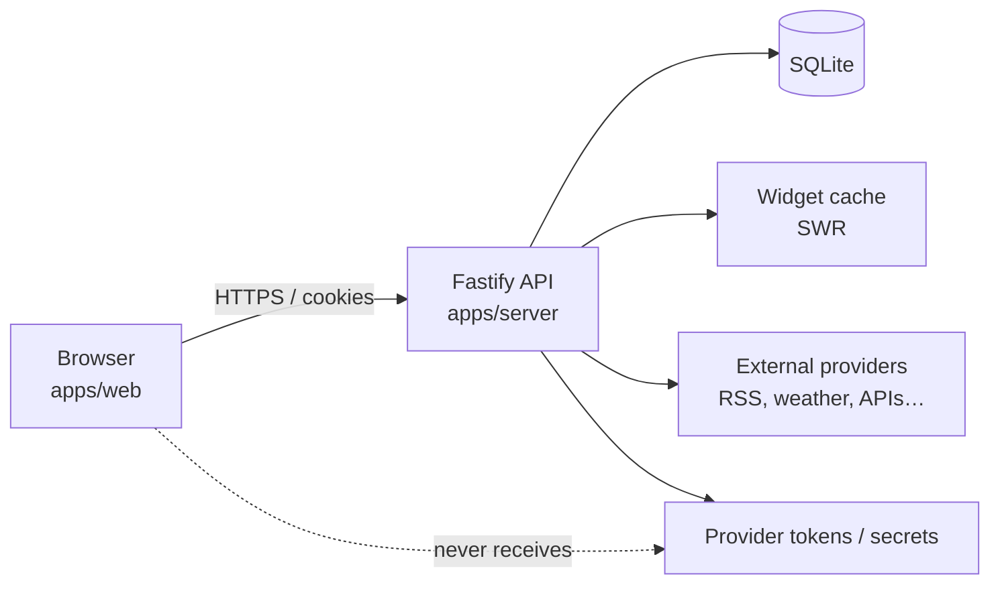

# Architecture

This document describes Dashora’s system shape, responsibility boundaries, and cross-cutting runtime rules. Product intent lives in [product-vision.md](./product-vision.md). Widget details live in [widget-system.md](./widget-system.md). Security details live in [security-model.md](./security-model.md).

## High-level shape

Dashora is a pnpm workspace monorepo:

```text
apps/web          React + Vite SPA (presentation, layout editing, widget shells)
apps/server       Fastify API (auth, config, secrets, widget data, cache, DB)
packages/ui       Shared visual primitives and theme tokens
packages/shared   Zod schemas and types shared across the wire
packages/widget-sdk
                  Widget contracts, states, registry helpers, demo-metrics example
```



## Frontend / backend responsibility boundary

### `apps/web` owns

- Rendering dashboard pages and the 12-column layout
- Widget shell UI for every runtime state (loading, refreshing, success, empty, stale, error, disabled, configuration-required)
- Client-side navigation, theme preference, and layout editing UX
- Calling Dashora APIs with session cookies
- Validating *public* response shapes with shared Zod schemas where useful

### `apps/server` owns

- Authentication and session lifecycle
- Persistence (SQLite via Drizzle) and migrations
- Provider credentials and secret materialization
- Outbound calls to third-party APIs and feeds
- Widget data resolution, caching, and stale-while-revalidate policy
- Authorization checks on mutating routes
- Structured logging without secret leakage

### Shared packages own

- Wire contracts and env validation (`@dashora/shared`)
- Widget definition and state contracts (`@dashora/widget-sdk`)
- Theme-aware primitives reused by web (and later admin surfaces) (`@dashora/ui`)

**Rule:** If a decision requires a secret, a privileged network call, or durable truth, it belongs on the server. If it is presentation, layout composition, or local UX state, it belongs on the web app.

## API surface

Versioned under `/api/v1`.

| Area | Responsibility |
| --- | --- |
| Health | Liveness / version for ops |
| Auth | Login, logout, session probe |
| Pages / layout | CRUD for dashboard pages and grid placement |
| Widgets | Instance config, enabled state, data fetch endpoints |
| Secrets / credentials | Create/update/delete provider credentials (values never echoed back in full) |
| Settings | Operator preferences that must be durable |

Every new route validates input with Zod and ships unit tests.

## Database ownership and migrations

- **Owner:** `apps/server` is the sole writer and schema owner of the SQLite database.
- **ORM / migrations:** Drizzle ORM + Drizzle Kit migrations checked into the repository.
- **Startup:** The server applies pending migrations before serving traffic (or fails closed if migration cannot run).
- **Clients:** The browser never opens SQLite and never embeds SQL. Web talks only to HTTP APIs.
- **Backup unit:** The SQLite file under `DASHORA_DATA_DIR` (plus any configured secret key material) is the durable backup boundary for v1. Operator steps: [infra/backup-restore.md](../infra/backup-restore.md).

See [ADR 0003](./adr/0003-sqlite-drizzle.md).

## Caching and stale-while-revalidate

Widget data is expensive relative to UI paint. The server owns a cache keyed by widget instance + normalized config hash.

Typical flow:

1. Client requests widget data.
2. If a fresh cache entry exists, return it as `success`.
3. If a cache entry exists but is past TTL, return it immediately as `stale` and refresh in the background (or inline with a short timeout budget).
4. If refresh succeeds, store the new payload and subsequent requests see `success`.
5. If refresh fails and last-good data exists, keep serving `stale` (or escalate to `error` after a policy threshold).
6. If no last-good data exists, return `error` or `empty` as appropriate.

Clients must render the `stale` state distinctly so operators know data may lag. Blanking the widget on every refresh is not acceptable.

## Layout model

Dashboards use a **12-column responsive grid**. Widget instances declare column span and row placement; breakpoints collapse spans on narrower viewports. Details are in [design-system.md](./design-system.md).

## Authentication (summary)

v1 uses server-issued HTTP-only session cookies after local credential verification. Optional OIDC is a later addition. Full rules are in [security-model.md](./security-model.md).

## Extension strategy (summary)

v1 extends Dashora by adding first-party widgets to the in-repo registry. Runtime loading of arbitrary third-party JavaScript is deferred. See [widget-system.md](./widget-system.md) and [ADR 0004](./adr/0004-widget-registry.md).

## Cross-cutting engineering rules

- TypeScript strict mode; avoid `any` unless documented and unavoidable
- Validate all external input with Zod
- Never expose provider tokens or secrets to the browser
- Never log passwords, cookies, tokens, secret values, or full authorization headers
- Every visual component supports light and dark themes
- Respect reduced motion and keyboard navigation
